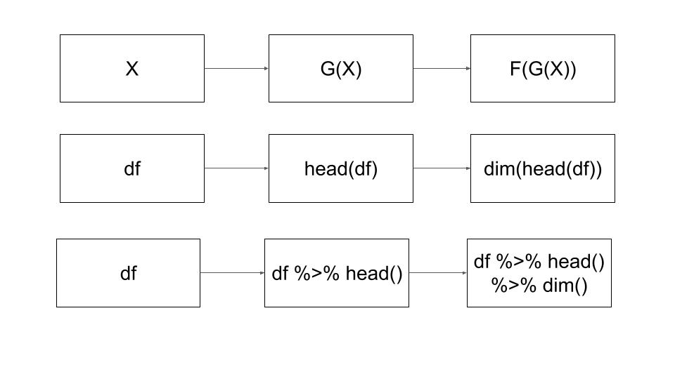

\newpage

```{r setup, include=FALSE}
#Options for R code chunks. 
knitr::opts_chunk$set(echo = TRUE)
```

Leaflet is an open-source JavaScript library for interactive maps. 

```{r}
#install.packages("geojsonR")
library("geojsonR")
#install.packages('leaflet')
library("leaflet")
library("sf")
library("dplyr") # Data Manipulation
library("sp")
```


# Data Manipulation with dplyr

Grouping and summarizing with dplyr using pipe operator: 
**%>%**

```{r}
#read the dataframe
rd<-read.csv("https://raw.githubusercontent.com/th2018/geojson/main/Researcher_directory_Tao.csv")
```

```{r}
# check the dimension of the dataframe
dim(rd)
rd %>% dim()

# Returns the first parts of a data frame
head(rd)
rd %>% head()

# (1) Returns the first parts of a data frame and (2) check the dimension of the dataframe
dim(head(rd))
rd %>% head() %>% dim()

```

```{r pipe, echo=FALSE, fig.cap="pipe", out.width = '100%'}

```

# Collecting geoJSON data from the web

What's the difference between geoJSON and Shapefile?

JSON (JavaScript object notation) is text-based format, which is in a string format.

GeoJSON is a subset of JSON. It can be loaded directly from the web.

https://opendata.cityofboise.org/datasets/wildland-urban-interface-wui-/data

```{r}
r2<-sf::read_sf("https://opendata.arcgis.com/datasets/88701cdd140e413684fbedf4e40f9332_0.geojson")

raster::plot(r2)

class(r2)

st_crs(r2)

```

https://opendata.arcgis.com/datasets/97713420149348f78c2fa1e4b5dbd5ea_4.geojson

```{r}
w<-sf::read_sf("https://opendata.arcgis.com/datasets/97713420149348f78c2fa1e4b5dbd5ea_4.geojson")
class(w)
#plot(w) #plot too long
```


```{r}
r3<-sf::read_sf("/Users/owner/Downloads/Wildland-Urban_Interface__WUI__-shp/Wildland-Urban_Interface__WUI__.shp")

#raster::plot(sf::st_geometry(r3))

r3 %>%st_geometry()  %>% plot()

raster::plot(r3)

class(r3)

```

```{r}

spplot(r)
```


```{r}

  addPolygons(addTiles(leaflet(r3)))
#addPolygons(map)
## map: a map widget object created from leaflet()

#addTiles: Add a tile layer to the map

#leaflet(data)
#Create a Leaflet map widget
```

Leaflet is one of the most popular open-source JavaScript libraries for interactive maps. 

```{r}
leaflet()%>%
  addTiles() %>%        # Add default OpenStreetMap map tiles
  addPolygons(data=r3 ,color = "red")
```

# Center and set an initial zoom level the map with setView(). 

```{r}
leaflet(r3 )%>%
  addTiles() %>%
  addPolygons(color = "red")%>%
    setView(lng =  -116.245665, lat = 43.604916, zoom = 12)
```

```{r}
m<-leaflet( )

m<-  addTiles(m) 

addPolygons( data =r3, map=m, fill = TRUE)
```

```{r}
devtools::session_info()
```

